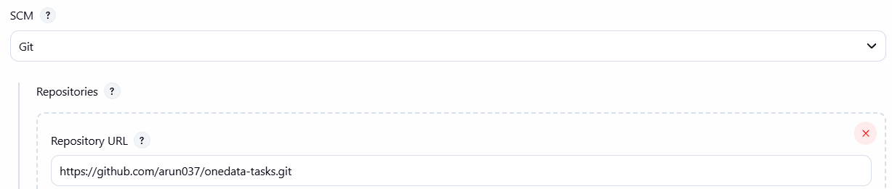
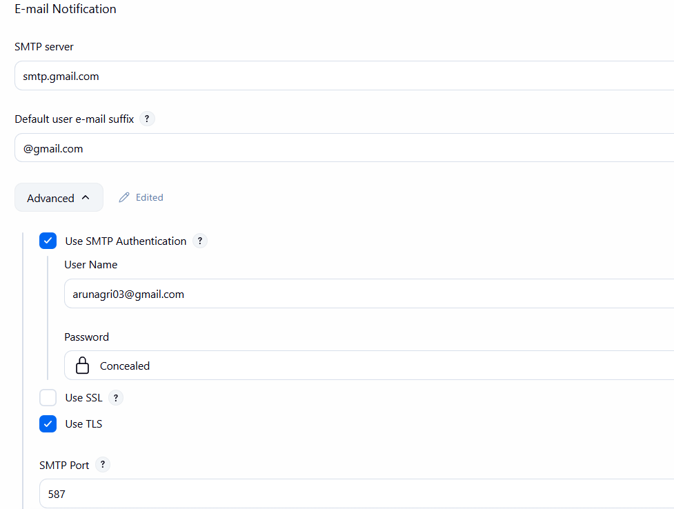
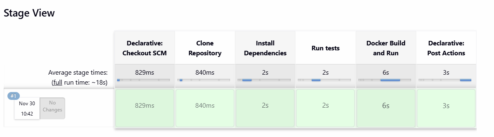
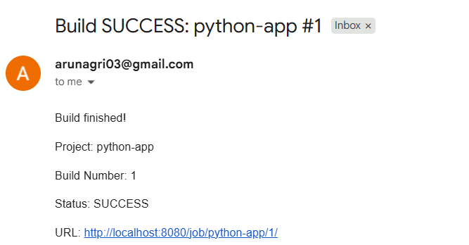

CI/CD Pipeline with Jenkins + Docker

step 1: use Jenkins docker image to run docker

docker run -d -p 8080:8080 \
-v jenkins_home:/var/jenkins_home \
-v /var/run/docker.sock:/var/run/docker.sock \
--group-add 989   \
jenkins/jenkins:lts

To make the data persistent we created jenkins_home volume and mounted to /var/jenkins_home, where jenkins stores build history, installed plugins etc.,

To allow the jenkins to execute docker commands mounted on /var/run/docke.sock and add jenkins to the docker group 989 on the host.

step 2: create a Jenkins file in the github repo with stages 
    - Checkout code
    - Install dependencies
    - Run test
    - Build docker image
    - Run the container using docker
    - post email notification

Step 3: Create a project on Jenkins

Configure Pipeline
    - Pipeline script from SCM (Git repo)
    - Repository URL: your GitHub URL
    - Branch: the branch where the code + Jenkinsfile exist
    - Jenkinsfile path 

Step 4: Install plugins - Pipeline stage view

step 5: configure smtp settings for email notifications

    use of App passwords from gmail

step 6: select the project and click on build now

