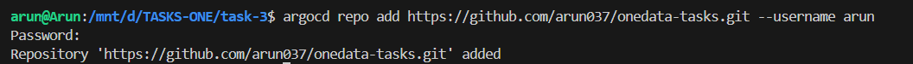
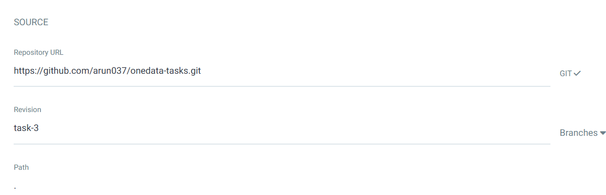
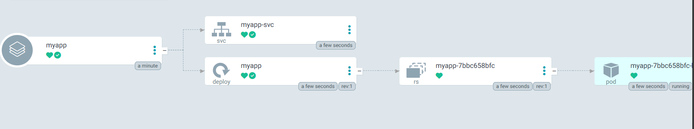
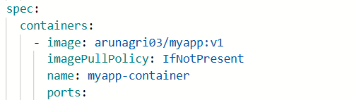
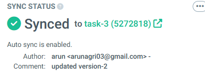

**Task-3: Kubernetes Deployment Using ARGOCD**
Step 1: Create a namespace and apply the manifests

step 2: Patch the argocd-server to node-port

step 3: Install argocd cli, get initial admin password and add cluster

login to the cluster

step 4: Add the repo to argocd

step 5: Create a new app and select the repo 

the deployment happens to the cluster by argocd

this was the image version first used

And if auto-sync is enabled argocd watches github for any changes and if it detects it sync with respect to github

