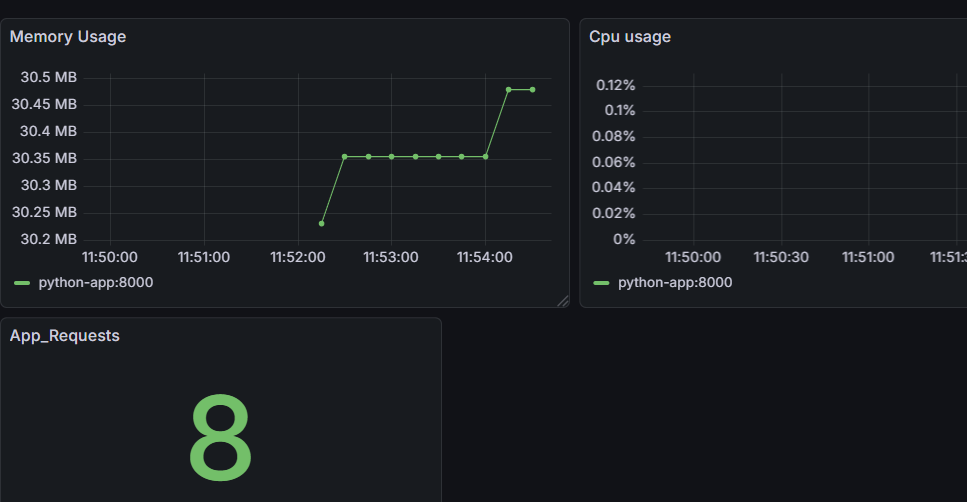

**Task-6: Monitoring Stack with Prometheus + Grafana**

Step 1: created a sample python code

step 2: use docker compose to build the app and bring monitoring stack up

Prometheus:
    - mounted the prometheus.yml file which contains the scrape configs from prometheus folder to the prometheus container at /etc/prometheus path
    - prometheus_data is a volume to make the data persistent.

Grafana:
    - it is used to visualize the metrics from prometheus.
    - mounted prometheus as a default datasouce to the grafana by mounting datasource.yml at  /etc/grafana/provisioning/datasources/ location on grafana.

step 3: execute docker compose command

    docker compose up --build -d

Step 4: the Grafana will be exposed on port 3000 and login with username and password and create a dashboard with prometheus as datasource.

